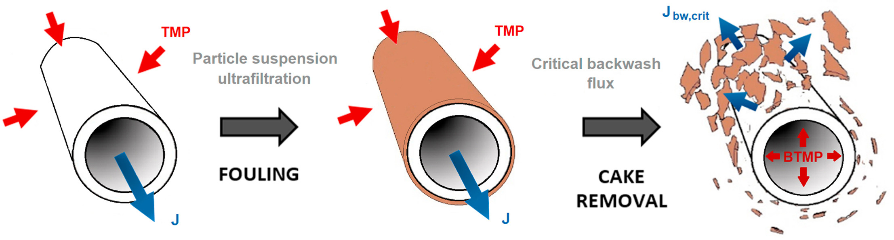
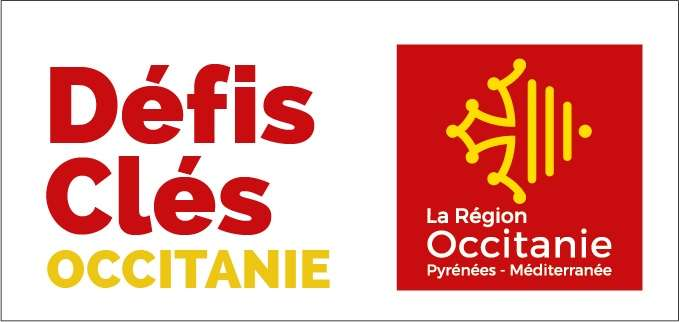

# Introduction

Production–regeneration systems describe processes that must alternate between a productive phase and a recovery phase. During production, the system generates an output (for example filtered water), but this phase also progressively degrades an internal state (such as fouling or resistance). The regeneration phase does the opposite: it restores the system’s internal condition, but does not directly produce useful output.

```@raw html
    
```

Such a system can naturally be formulated as an optimal control problem. The main objective of this package is to provide tools to analyze and solve problems of this type.

# Problem statement

We consider the following three-dimensional dynamical system defined for both production and regeneration modes: 

```math
u = +1 : \left\{ \begin{array}{rl}
\dot c(t) &= l_p(x(t)) \\[0.5em]
\dot x(t) &= f_p(x(t)) \\[0.5em]
\dot y(t) &= g_p(x(t))
\end{array} \right.
\quad \text{and} \quad  
u = -1 : \left\{ \begin{array}{rl}
\dot c(t) &= l_r(x(t)), \\[0.5em]
\dot x(t) &= f_r(x(t)), \\[0.5em]
\dot y(t) &= g_r(x(t)),
\end{array} \right.
```
where :
- ``c`` denotes the cost,
- ``x`` represents the internal state of the system,
- ``y`` is an auxiliary state associated with a target value (or budget constraint), denoted by ``T``.

Let ``u \in [-1, 1]`` be the control variable, where `` u = +1`` denotes production mode and ``u = -1`` denotes regeneration mode, we consider the following optimal control problem

```math
\text{(OCP)} \quad
\left\{ 
\begin {array}{ll}
\displaystyle \min_{x,y,t_f} \int_{t_0}^{t_f} \frac{1 + u(t)}{2} l_p(x(t)) + \frac{1-u(t)}{2} l_r(x(t)) \, \mathrm dt, 
& t \in [t_0, t_f] \ \mathrm{a.e.}, \\[1em]
\displaystyle \mathrm{s.t.} \ \dot x(t) = \frac{1 + u(t)}{2} f_p(x(t)) + \frac{1-u(t)}{2} f_r(x(t)), & t \in [t_0, t_f] \ \mathrm{a.e.}, \\[1em] 
\displaystyle \phantom{\mathrm{s.t.} \ } \dot y(t) = \frac{1 + u(t)}{2} g_p(x(t)) + \frac{1-u(t)}{2} g_r(x(t)), \, & t \in [t_0, t_f] \ \mathrm{a.e.}, \\[1em]
\phantom{\mathrm{s.t.} \ } u(t) \in [-1, 1], & t \in [t_0, t_f], \\[1em]
\phantom{\mathrm{s.t.} \ } x(t_0) = x_0, \quad y(t_0) = y_0, \quad y(t_f) = T,
\end{array}
\right.
```
where ``t_0 \in \mathbb R``, ``x_0 > 0 ``, ``y_0 > 0`` and ``T > 0`` are provided.  

# Main theorical results

Based on the theoretical developments presented in [Dutto et al., 2026](https://hal.science/hal-05493075), all possible optimal solution structures are characterized by the following result:

!!! tip "Theorem"
    Under standard regularity assumptions, and denoting 
    - ``\sigma_-`` a regeneration arc associated to ``u = -1``,
    - ``\sigma_+`` a production arc associated to ``u = +1``,
    - ``\sigma_s`` a singular arc associated to ``u = u_s``,
    the structure of an optimal solution can only be one of the following:
    ```math
    \sigma_+, \
    \sigma_-\sigma_+, \ 
    \sigma_s\sigma_+, \
    \sigma_-\sigma_s\sigma_+ ~
    \text{or} ~
    \sigma_+\sigma_s\sigma_+.
    ```

Here, ``u_s`` denotes a singular control such that ``\dot x = 0``. See [Dutto et al., 2026](https://hal.science/hal-05493075) for a detailed presentation and proof.

## Reproducibility

```@setup main
using Pkg
using InteractiveUtils
using Markdown

# Download links for the benchmark environment
function _downloads_toml(DIR)
    link_manifest = joinpath("assets", DIR, "Manifest.toml")
    link_project = joinpath("assets", DIR, "Project.toml")
    return Markdown.parse("""
    You can download the exact environment used to build this documentation:
    - 📦 [Project.toml]($link_project) - Package dependencies
    - 📋 [Manifest.toml]($link_manifest) - Complete dependency tree with versions
    """)
end
```

```@example main
_downloads_toml(".") # hide
```

```@raw html
<details style="margin-bottom: 0.5em; margin-top: 1em;"><summary>ℹ️ Version info</summary>
```

```@example main
versioninfo() # hide
```

```@raw html
</details>
```

```@raw html
<details style="margin-bottom: 0.5em;"><summary>📦 Package status</summary>
```

```@example main
Pkg.status() # hide
```

```@raw html
</details>
```

```@raw html
<details style="margin-bottom: 0.5em;"><summary>📚 Complete manifest</summary>
```

```@example main
Pkg.status(; mode = PKGMODE_MANIFEST) # hide
```

```@raw html
</details>
```

# Parteners and Fundings

```@raw html
<div style="display: flex; align-items: center; justify-content: center; gap: 20px;">
    
    
    
</div>
```